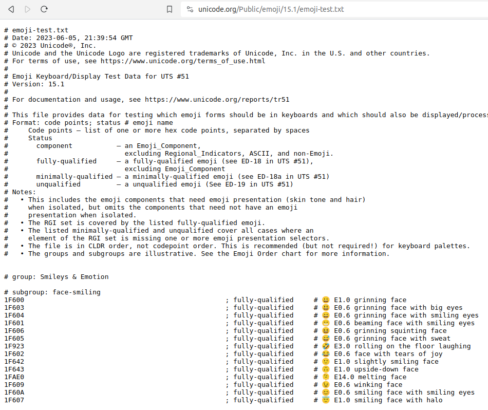
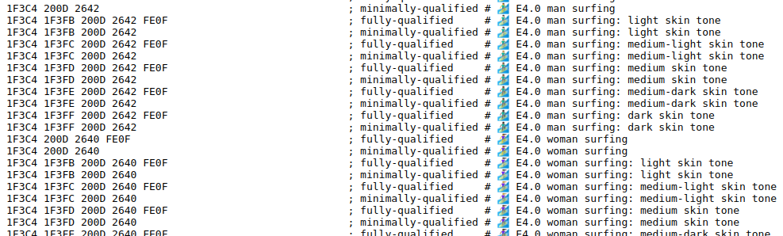
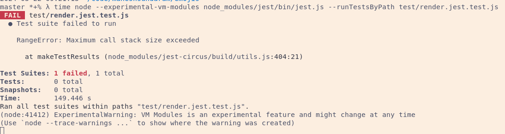
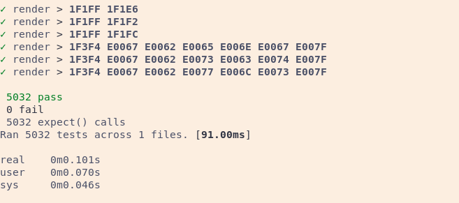
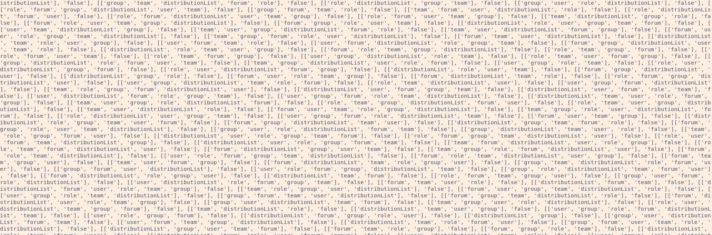

# "1F3C4-1F3FC-200D-2642-FE0F" => 🏄🏼‍♂️ 

```typescript
export const render = (hex_code_points: string[]) =>
  hex_code_points.split(" ").map((point) => String.fromCodePoint(parseInt(point, 16))).join("");
```

---

The latest 15.1 spec data is a mostly structured text file of 5326 lines

---



---



---

# Node - Parsing

```typescript
for (const line of lines) {
  const clean = line.trim();
  if (!clean) continue;
  if (clean === "\n" || clean.startsWith("#")) continue;
  const [left, right] = clean.split("#");
  const [hex_code_points, qualified_status] = left.split(";");
  const version_test = right.match(match_version);
  if (version_test && version_test.index) {
    const [version] = version_test;
    const { index } = version_test;
    const emoji = right.slice(0, index);
    const description = right.slice(index + version.length);
    const [name, modifiers] = description.split(":");

    const row = {
      hex_code_points: hex_code_points.trim(),
      qualified_status: qualified_status.trim(),
      emoji: emoji.trim(),
      version: version.trim(),
      name: name.trim(),
      ...(modifiers && { modifiers: modifiers.trim() }),
    };

    emoji_data_by_hex[row.hex_code_points] = row;
  }
  const data = JSON.stringify(emoji_data_by_hex);
  const pretty_data = JSON.stringify(emoji_data_by_hex, null, "  ");
  fs.writeFileSync("./build/node/emoji_data_by_hex.json", data);
  fs.writeFileSync("./build/node/emoji_data_by_hex_pretty.json", pretty_data);
}
```

---

# Node - Results

For n = 10

Measure | Seconds
----|---
Min | 43.432s
Avg | 46.027s
Max | 47.634s
Median | 46.238s

---

# Deno - Parsing

Same `for ... of` loop, but different file operations:

```typescript
const data = Deno.readTextFileSync("./emoji-test.txt");
// ...
Deno.writeTextFileSync("./build/deno/emoji_data_by_hex.json", data);
Deno.writeTextFileSync("./build/deno/emoji_data_by_hex_pretty.json", pretty_data);
```

---

# Deno - Results

Measure | Seconds
----|---
Min | 39.804s
Avg | 41.218s
Max | 43.831s
Median | 40.649s

---

# Bun - Parsing

Same `for ... of` loop, but different file operations:

```typescript
const file = Bun.file("./emoji-test.txt");
const raw_data = await file.text();
// ...
Bun.write("./build/bun/emoji_data_by_hex.json", data);
Bun.write("./build/bun/emoji_data_by_hex_pretty.json", pretty_data);
```

---

# Bun - Results

Measure | Seconds
----|---
Min | 26.559s
Avg | 27.354s
Max | 28.233s
Median | 27.423s

---

# Python - Parsing

```python
for line in lines:
    clean = line.strip()
    if not clean or clean.startswith("#"):
        continue

    left, right = clean.split("#", maxsplit=1)
    hex_code_points, qualified_status = left.split(";")
    version_test = match_version.search(right)

    if version_test:
        version = version_test.group(0)
        index = version_test.start()
        emoji = right[:index].strip()
        description = right[index + len(version) :].strip()
        name, *modifiers = description.split(":")
        modifiers = modifiers[0].strip() if modifiers else None

        row = {
            "hex_code_points": hex_code_points.strip(),
            "qualified_status": qualified_status.strip(),
            "emoji": emoji.strip(),
            "version": version.strip(),
            "name": name.strip(),
            **({"modifiers": modifiers.strip()} if modifiers else {}),
        }

        emoji_data_by_hex[row["hex_code_points"]] = row
```

---

# Python - Parsing


```python
with open("./build/python/emoji_data_by_hex.json", "w", encoding="utf-8") as file:
    file.write(data)

with open(
    "./build/python/emoji_data_by_hex_pretty.json", "w", encoding="utf-8"
) as file:
    file.write(pretty_data)
```

---

# Python - Results

Measure | Seconds
----|---
Min | 0.092s
Avg | 0.095s
Max | 0.115s
Median | 0.093s

---

# All Results

Runtime | Min | Average | Max | Median
--- | --- | --- | --- | ---
Python|  0.092s|   0.095s|  0.115s|  0.093s
Bun|     26.559s|  27.354s| 28.233s| 27.423s
Deno|    39.804s|  41.218s| 43.831s| 40.649s
Node|    43.432s|  46.027s| 47.634s| 46.238s

---

# Python is approximately:

288 times faster than Bun
434 times faster than Deno
484 times faster than Node

---

# Jest

```bash
time node --experimental-vm-modules node_modules/jest/bin/jest.js --runTestsByPath test/render.jest.test.js 
```

---

# 149.446s to wait for failure



---

# Bun

```bash
bun test test/render.bun.test.ts
```

---

# 91.00ms



Average across 10 runs: 97ms

---

# More Python

---

# Combinations, Permutations

```python
from itertools import combinations, chain, permutations

expected = ["team", "role", "user", "group", "distributionList", "forum"]

# Cases that should pass
all_correct_combinations = list(
    chain(*map(lambda x: combinations(expected, x), range(1, len(expected) + 1)))
)
```

---

```python
[('team',),
 ('role',),
 ('user',),
 ('group',),
 ('distributionList',),
 ('forum',),
 ('team', 'role'),
 ('team', 'user'),
 ('team', 'group'),
 ('team', 'distributionList'),
 ('team', 'forum'),
 ('role', 'user'),
 ('role', 'group'),
 ('role', 'distributionList'),
 ('role', 'forum'),
 ('user', 'group'),
 ('user', 'distributionList'),
 ('user', 'forum'),
 ('group', 'distributionList'),
 ('group', 'forum'),
 ('distributionList', 'forum'),
 ('team', 'role', 'user'),
 ('team', 'role', 'group'),
 ('team', 'role', 'distributionList'),
 ('team', 'role', 'forum'),
 ('team', 'user', 'group'),
 ('team', 'user', 'distributionList'),
 ('team', 'user', 'forum'),
 ('team', 'group', 'distributionList'),
 ('team', 'group', 'forum'),
 ('team', 'distributionList', 'forum'),
 ('role', 'user', 'group'),
 ('role', 'user', 'distributionList'),
 ('role', 'user', 'forum'),
 ('role', 'group', 'distributionList'),
 ('role', 'group', 'forum'),
 ('role', 'distributionList', 'forum'),
 ('user', 'group', 'distributionList'),
 ('user', 'group', 'forum'),
 ('user', 'distributionList', 'forum'),
 ('group', 'distributionList', 'forum'),
 ('team', 'role', 'user', 'group'),
 ('team', 'role', 'user', 'distributionList'),
 ('team', 'role', 'user', 'forum'),
 ('team', 'role', 'group', 'distributionList'),
 ('team', 'role', 'group', 'forum'),
 ('team', 'role', 'distributionList', 'forum'),
 ('team', 'user', 'group', 'distributionList'),
 ('team', 'user', 'group', 'forum'),
 ('team', 'user', 'distributionList', 'forum'),
 ('team', 'group', 'distributionList', 'forum'),
 ('role', 'user', 'group', 'distributionList'),
 ('role', 'user', 'group', 'forum'),
 ('role', 'user', 'distributionList', 'forum'),
 ('role', 'group', 'distributionList', 'forum'),
 ('user', 'group', 'distributionList', 'forum'),
 ('team', 'role', 'user', 'group', 'distributionList'),
 ('team', 'role', 'user', 'group', 'forum'),
 ('team', 'role', 'user', 'distributionList', 'forum'),
 ('team', 'role', 'group', 'distributionList', 'forum'),
 ('team', 'user', 'group', 'distributionList', 'forum'),
 ('role', 'user', 'group', 'distributionList', 'forum'),
 ('team', 'role', 'user', 'group', 'distributionList', 'forum')]
```

---

```python
for r in range(1, len(expected) + 1):
    for combination in combinations(expected, r):
        for permutation in permutations(combination, r):
            all_unique_permutations.add(permutation)

# Cases that should fail
all_incorrect_combinations = [
    permutation
    for permutation in all_unique_permutations
    if not is_correct_order(permutation)
]

sample = random.sample(all_incorrect_combinations, 30)
```

---



---

```typescript
const isDev = !apiEnv.includes('prod') && (featureMatch || localHostMatch || xyzMatch);
// or
const isDev = !apiEnv.includes('prod') || featureMatch || localHostMatch || xyzMatch;
```

---

```python
import pandas as pd

combinations = [
    (P, L, F, X)
    for P in [False, True]
    for L in [False, True]
    for F in [False, True]
    for X in [False, True]
]

and_results = [
    {
        "isDev": not P and (F or L or X),
        'apiEnv.includes("prod")': P,
        "localhostMatch": L,
        "featureMatch": F,
        "xyzMatch": X,
    }
    for P, L, F, X in combinations
]

and_truth_table = pd.DataFrame(and_results)

or_results = [
    {
        "isDev": not P or (F or L or X),
        'apiEnv.includes("prod")': P,
        "localhostMatch": L,
        "featureMatch": F,
        "xyzMatch": X,
    }
    for P, L, F, X in combinations
]

or_truth_table = pd.DataFrame(or_results)
```

---


```python
 const isDev = !apiEnv.includes('prod') && (featureMatch || localHostMatch || xyzMatch);

    isDev  apiEnv.includes("prod")  localhostMatch  featureMatch  xyzMatch
--------------------------------------------------------------------------
0    True                    False           False         False      True
1    True                    False           False          True     False
2    True                    False           False          True      True
3    True                    False            True         False     False
4    True                    False            True         False      True
5    True                    False            True          True     False
6    True                    False            True          True      True
7   False                    False           False         False     False
8   False                     True           False         False     False
9   False                     True           False         False      True
10  False                     True           False          True     False
11  False                     True           False          True      True
12  False                     True            True         False     False
13  False                     True            True         False      True
14  False                     True            True          True     False
15  False                     True            True          True      True

 const isDev = !apiEnv.includes('prod') || featureMatch || localHostMatch || xyzMatch;

    isDev  apiEnv.includes("prod")  localhostMatch  featureMatch  xyzMatch
--------------------------------------------------------------------------
0    True                    False           False         False     False
1    True                    False           False         False      True
2    True                    False           False          True     False
3    True                    False           False          True      True
4    True                    False            True         False     False
5    True                    False            True         False      True
6    True                    False            True          True     False
7    True                    False            True          True      True
8    True                     True           False         False      True
9    True                     True           False          True     False
10   True                     True           False          True      True
11   True                     True            True         False     False
12   True                     True            True         False      True
13   True                     True            True          True     False
14   True                     True            True          True      True
15  False                     True           False         False     False
```
